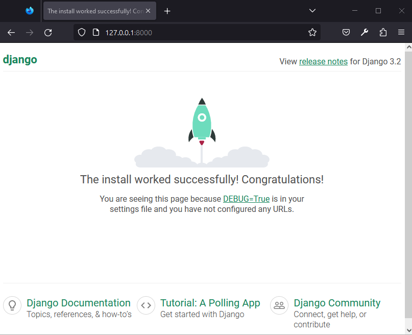
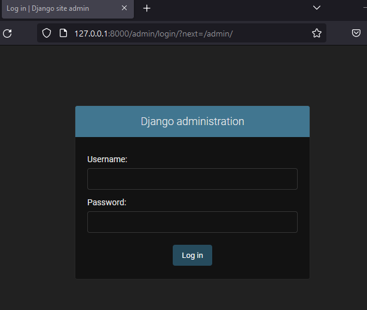
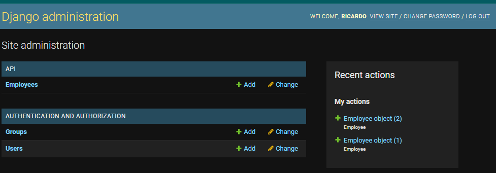

# Configuración del entorno
### Windows
> install pip 
`python.exe -m pip install --upgrade pip`

>install virtualenv
`pip install virtualenv`

> create avirtualenv 
`virtualenv -p python3 env`

> activate virtualenv
`.\env\Scripts\`

>install django
`pip install Django==3.2.4`

> install MySQL connectors
`pip install mysqlclient pymysql`

>pip list: list all installations

>create a django project
`django-admin startproject Project_API`

>create django api app
`django-admin startapp api`

>edit Project_API -> settings.py

>add databases Project_API -> settings.py

> see a MySQL connection
`python manage.py migrate`

> create a superuser for admin pannel
`python manage.py createsuperuser`

>migration models
`python manage.py makemigrations`

> run adminserver
`python manage.py runserver`

### DJANGO SERVER

>URL admin
`http://127.0.0.1:8000/admin/login/?next=/admin/`

